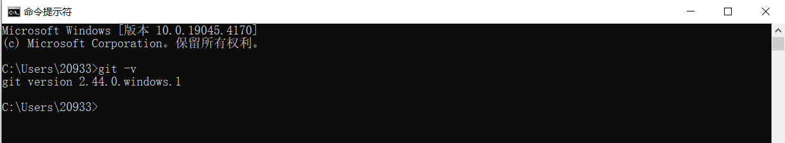
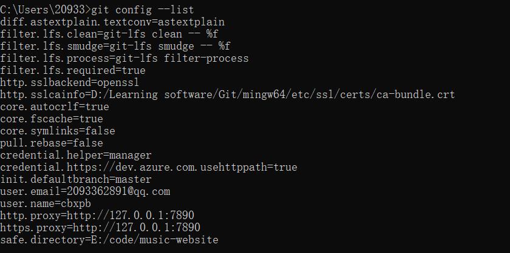
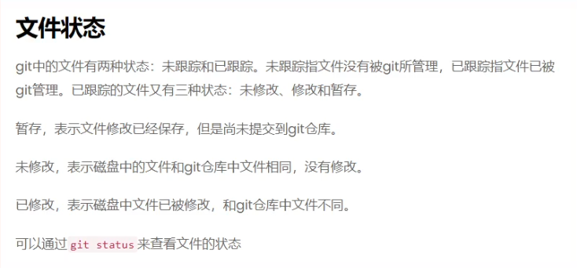

# Git

## 1、Git简介

 		Git是一个开源的[分布式](https://baike.baidu.com/item/分布式/19276232?fromModule=lemma_inlink)版本控制系统，可以有效、高速地处理从很小到非常大的项目[版本管理](https://baike.baidu.com/item/版本管理/2511538?fromModule=lemma_inlink)。也是[Linus Torvalds](https://baike.baidu.com/item/Linus Torvalds/9336769?fromModule=lemma_inlink)为了帮助管理[Linux内核](https://baike.baidu.com/item/Linux内核/10142820?fromModule=lemma_inlink)开发而开发的一个开放源码的[版本控制软件](https://baike.baidu.com/item/版本控制软件/2617766?fromModule=lemma_inlink)。

## 2、Git安装

​		**安装地址**： **[Git (git-scm.com)](https://git-scm.com/) 或 [Git for Windows](https://gitforwindows.org/)** 

​		**安装方式**：一直下一步就行

​		**查看是否安装成功**：**git -v** 出现版本号就代表安装成功



## 3、Git使用

### 		1、配置

​		**name:** git config --global user.name " username "

​		**email:** git config --global user.email " email "

​		将**username**和**email**换成github（或者其它类似远程仓库）的**用户名**和**邮箱**。 


​		查看是否配置成功**： git config --list 



### 		2、使用

​					**1、git status**

​						 -- 查看当前仓库的状态

​					**2、git init**

​						 -- 初始化git仓库

​					**3、git add  &lt; filebane> **

​						 ***--未跟踪 ---> 暂存***

​							 -- 将项目中处于未跟踪状态的文件切换到暂存的状态

​						  **git add *** 

​							 -- 将所有已修改或未跟踪的文件暂存

​					**4、git commit -m " messages "**

​						 ***--暂存 ---> 未修改***

​						   --  将暂存的文件存储到仓库中

​					**5、*--未修改---> 修改***

​						   --  修改代码后，文件会变为修改状态，这时需要重新执行3、4步骤或者

​								直接执行**git commit -a -m "messages "**

​					**6、git commit -a -m "messages "**

​						  --  提交所有已修改的文件到仓库中（未跟踪的文件不会提交）

### 		3、注意



​							Git使用git config 指令来指定与git相关的配置

​							config 配置有system级别、global（用户级别）、和local（当前仓库）三个级别，三个设置范围							system-》global-》local  底层配置会覆盖顶层配置 分别使用--system/global/local 可以定位到配							置文件


**对于git restore 命令，会撤销文件的修改，使文件恢复到暂存区或本地代码库（取决于文件在修改前的状态）；**

**对于git restore --staged 命令，把文件从暂存区撤回到工作区，保留文件最后一次修改的内容；**

### 4、Git常用命令

​	**1、重置文件**

```bash
#对于git restore 命令，会撤销文件的修改，使文件恢复到暂存区或本地代码库（取决于文件在修改前的状态）
git restore <filename>				# 恢复文件
#对于git restore --staged 命令，把文件从暂存区撤回到工作区，保留文件最后一次修改的内容
git restore --staged <filename>		# 取消暂存状态
```

​	**2、删除文件**

```bash
#对于git rm 命令，把文件删除
git rm <filename>
#对于git rm -f 命令，把文件强制删除
git rm -f <filename>
```

​	**3、移动文件**

```bash
git mv from to # 移动文件 重命名文件  git mv 1.txt 2.txt
```

### 5、分支

 git 在存储文件时，每一次代码的提交都会创建一个与之对应的节点，git 就是通过一个一个的节点来记录代码的状态的。节点会构成一个树状结构，树状结构就意味着这个树会存在分支，默认情况下仓库只有一个分支，命名为 master。在使用 git 时，可以创建多个分支，分支与分支之间相互独立，在一个分支上修改代码不会影响其他的分支。 

```bash
git branch # 查看当前分支
git branch <branch name> # 创建新的分支
git branch -d <branch name> # 删除分支 -d参数用来删除一个分支，前提是该分支没有未合并的变动。
git branch -D <branch name> # 强制删除分支 -D参数用来强制删除一个分支，不管有没有未合并变化。
git switch <branch name> # 切换分支
git switch -c <branch name> # 创建并切换分支
git merge <branch name> # 和并分支
```

 在开发中，都是在自己的分支上编写代码，代码编写完成后，在将自己的分支合并到主分支中。 

### 6、变基

在开发中除了通过 merge 来合并分支外，还可以通过变基来完成分支的合并。

我们通过 merge 合并分支时，在提交记录中会将所有的分支创建和分支合并的过程全部都显示出来，这样当项目比较复杂，开发过程比较波折时，我必须要反复的创建、合并、删除分支。这样一来将会使得我们代码的提交记录变得极为混乱。

原理（变基时发生了什么）：

1. 当我们发起变基时，git 会首先找到两条分支的最近的共同祖先
2. 对比当前分支相对于祖先的历史提交，并且将它们提取出来存储到一个临时文件中
3. 将当前部分指向目标的基底
4. 以当前基底开始，重新执行历史操作

变基和 merge 对于合并分支来说最终的结果是一样的！但是变基会使得代码的提交记录更整洁更清晰！注意！大部分情况下合并和变基是可以互换的，但是如果分支已经提交给了远程仓库，那么这时尽量不要变基。

```bash
git rebase <branch name>
```

### 7、远程仓库（remote）

目前我对于 git 所有操作都是在本地进行的。在开发中显然不能这样的，这时我们就需要一个远程的 git 仓库。远程的 git 仓库和本地的本质没有什么区别，不同点在于远程的仓库可以被多人同时访问使用，方便我们协同开发。在实际工作中，git 的服务器通常由公司搭建内部使用或是购买一些公共的私有 git 服务器。我们学习阶段，直接使用一些开放的公共 git 仓库。目前我们常用的库有两个：GitHub 和 Gitee（码云）

将本地库上传 github：

```bash
git remote add origin https://github.com/cbxpb/Front-End-Notes.git
# git remote add <remote name> <url>
git branch -M main
# 修改分支的名字的为main
git push -u origin main
# git push -u <remote name> main 将代码上传到服务器上
```

### 8、远程库的操作命令

```bash
git remote # 列出当前关联的远程库
git remote add <远程库名> <url> # 关联远程仓库
git remote remove <远程库名>  # 删除远程库
git push -u <远程库名> <分支名> # 向远程库推送代码，并和当前分支关联
git push <远程库> <本地分支>:<远程分支>
git clone <url> # 从远程库下载代码

git push # 如果本地的版本低于远程库，push默认是推不上去
git fetch # 要想推送成功，必须先确保本地库和远程库的版本一致，fetch它会从远程仓库下载所有代码，但是它不会将代码和当前分支自动合并
		 # 使用fetch拉取代码后，必须要手动对代码进行合并
git pull  # 从服务器上拉取代码并自动合并
```

 注意：推送代码之前，一定要先从远程库中拉取最新的代码 

### 9、tag 标签

- 当头指针没有指向某个分支的头部时，这种状态我们称为分离头指针（HEAD detached），分离头指针的状态下也可以操作代码，但是这些操作不会出现在任何的分支上，所以注意不要在分离头指针的状态下来操作仓库。
- 如果非得要回到后边的节点对代码进行操作，则可以选择创建分支后再操作

```bash
git switch -c <分支名> <提交id>
```

-  可以为提交记录设置标签，设置标签以后，可以通过标签快速的识别出不同的开发节点： 

```bash
git tag	# 查看标签名
git tag <版本> # 为当前节点打上标签
git tag 版本 提交id # 为指定节点打上标签
git push 远程仓库 标签名 # 上传标签到远程仓库
git push 远程仓库 --tags # 上传所有标签到远程仓库
git tag -d 标签名 # 删除本地仓库标签
git push 远程仓库 --delete 标签名 # 删除远程仓库标签
```

### 10、gitignore

- 默认情况下，git 会监视项目中的所有内容，但是有些内容比如 node_modules 目录中的内容，我们不希望它被 git 所管理。我们可以在项目目录中添加一个`.gitignore`文件，来设置那些需要 git 忽略的文件。